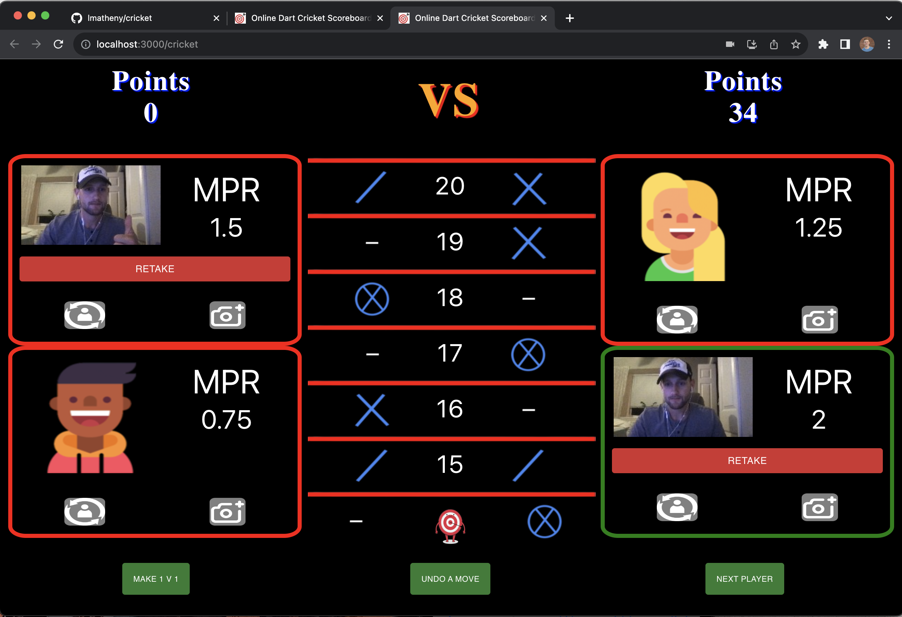
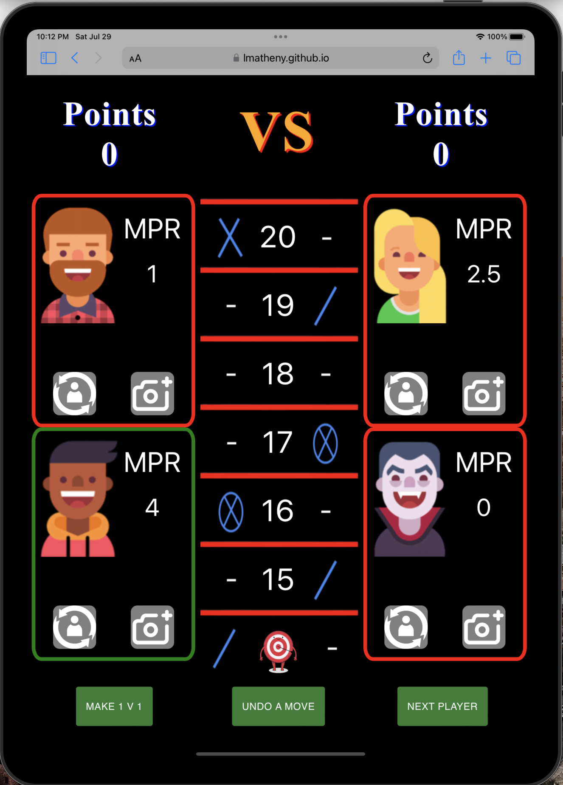
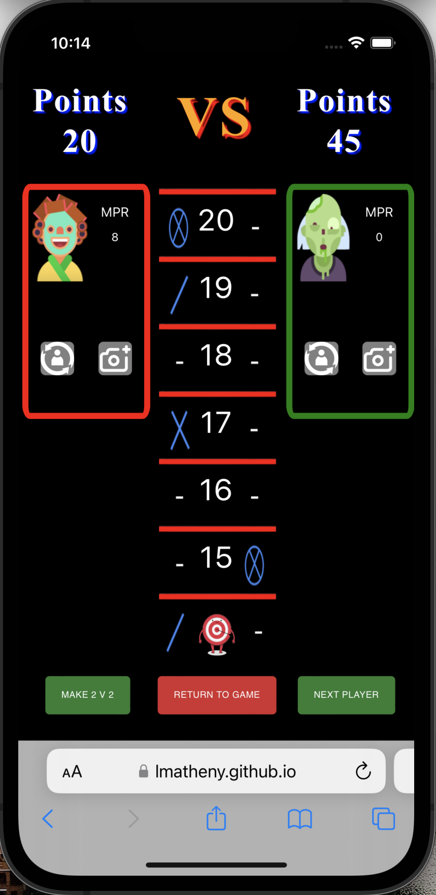

Certainly! Here's the updated README with the additional sections about detecting mobile and web devices, as well as the feature of detecting the end of a game and prompting users to start over:

# Dartboard Cricket Scoreboard

The Dartboard Cricket Scoreboard is a web application that provides a digital scoreboard to keep track of Cricket games. It offers the following features:

## Features

1. **1 v 1 or 2 v 2 Gameplay:** Engage in one-on-one competitions or team up for doubles matches. The scoreboard accommodates both game modes, allowing users to choose their preferred gameplay style.

2. **Custom Avatars:** Personalize your gaming experience by selecting from a variety of avatars. Alternatively, users can use their device's camera to capture a picture for a custom avatar, adding a personal touch to the game.

3. **Marks Per Round (MPR) Tracking:** The scoreboard intelligently tracks each player's Marks Per Round (MPR) as the game progresses. This feature enables players to monitor their performance and assess their accuracy and consistency over time.

4. **Undo Move:** To ensure a fair and enjoyable gaming experience, the "Undo" button allows users to revert unintended or mistaken moves during the game.

5. **Automatic Game Over Detection:** The scoreboard automatically detects when a Cricket game is over. It prompts users to start over with a new match, allowing for seamless and continuous gameplay.

## Getting Started

Follow these instructions to set up the Dartboard Cricket Scoreboard project on your local machine for development and testing:

### Prerequisites

* Node.js - Ensure that Node.js is installed on your machine.

### Installation

1. Clone the repository to your local machine using the following command:

```bash
git clone https://github.com/your-username/dartboard-cricket-scoreboard.git
```

2. Navigate to the project directory:

```bash
cd dartboard-cricket-scoreboard
```

3. Install the required dependencies:

```bash
npm install
```

### Usage

1. Start the application:

```bash
npm start
```

2. Access the scoreboard by opening your web browser and visiting `http://localhost:3000`.

3. Select the desired game mode (1 v 1 or 2 v 2) and choose avatars for each player or capture live images with your device's camera.

4. As the game progresses, update the score by clicking on the dartboard numbers. The MPR will be automatically calculated and displayed for each player.

5. The scoreboard will detect when a game is over, and it will prompt users to start over with a new match.

6. To undo a move, simply click on the "Undo" button.

## Device Detection

The Dartboard Cricket Scoreboard employs device detection to distinguish between mobile and web devices. The application automatically adjusts its interface to provide an optimized user experience based on the device type.

## React Webcam

The Dartboard Cricket Scoreboard utilizes the "React Webcam" library to enable users to capture live images with their device's camera. This feature enhances the personalization of avatars, allowing players to create custom profile pictures effortlessly.

For more information on "React Webcam," visit the [GitHub repository](https://github.com/mozmorris/react-webcam).

## Material UI

The Dartboard Cricket Scoreboard employs the "Material UI" library to provide a polished and modern user interface. Material UI components enhance the application's visual appeal, ensuring an intuitive and enjoyable user experience.

For more information on "Material UI," visit the [official website](https://material-ui.com/).

### Contributing

We welcome contributions to this project. If you would like to contribute, please follow these steps:

1. Fork the repository.

2. Create a new branch for your feature or bug fix.

3. Make your changes and commit them with clear and descriptive messages.

4. Push your changes to your forked repository.

5. Submit a pull request to the original repository with a detailed explanation of your changes.

## License

This project is licensed under the MIT License. For more information, see the [LICENSE](LICENSE) file.

## Game Screenshots

**Web**

<p align="left">
  
</p>


**Tablet**

<p align="left">
  
</p>


**Mobile**

<p align="left">
  
</p>


## Contact

For any inquiries or feedback, please feel free to reach us at [lmatheny277@gmail.com](mailto:lmatheny277@gmail.com).

---

With these revisions, the README now includes sections about device detection and the feature of detecting when a game is over, prompting users to start over. The language remains professional and suitable for presenting the project to a wider audience. Remember to replace the placeholders with your actual information before publishing the README on your GitHub repository. If you have any further questions or need additional assistance, feel free to ask.
